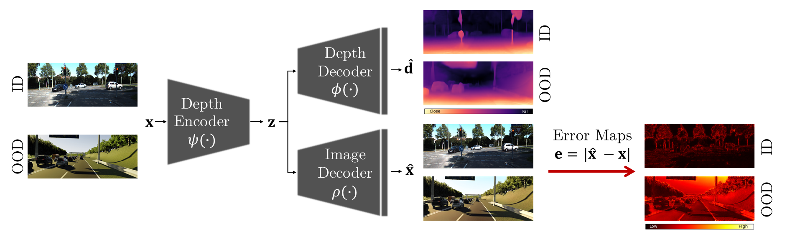

# Out-of-Distribution Detection for Monocular Depth Estimation

This repository contains the official implementation of our  ICCV 2023 paper.



## Requirements
The out-of-distribution detection is implemented for different models.
Since the models run with different pytorch versions and other varying packages, we provide the `*_environment.yml` files with the required packages. 
The files can be used to create the required Anaconda environments.
The file for Monodepth2 is named `monodepth2_environment.yml`, the file for MonoViT is named `monovit_environment.yml`. 
The correct environment must be loaded to run the code of the respective model.

Prepare Monodepth2: 
1. Download the `monodepth2` repository: [Monodepth2](https://github.com/nianticlabs/monodepth2) and place it in the folder `monodepth2_ood`. 
2. Replace `from kitti_utils import generate_depth_map` with `from ..kitti_utils import generate_depth_map` in the file `monodepth2/kitti_dataset.py` in `line 14`. 
3. Replace `from layers import *` with `from ..layers import *` in the file `monodeth2/networks/depth_decoder.py` in `line 14`.
4. Replace `class MonodepthOptions:` with `class MonodepthOptions(object):` in the file `monodepth2/options.py` in `line 15`.
5. Add `import sys` and `sys.path.append("monodepth2")` to the file `monodepth2/trainer.py` before `from utils.py import *`.  
6. In line 86 of the file `kitti_utils.py` replace `np.int` with `np.int32`

Prepare MonoViT:
7. Download the `monovit` repository: [MonoViT](https://github.com/zxcqlf/MonoViT/tree/main) and place it in the folder `monovit_ood`.
8. Download the mpvit-small model as specified by the repository to `monovit/ckpt/`. 
9. In line 785, 815 of the file `mpvit.py` change `./ckpt/mpvit_xsmall.pth'` to `./monovit/ckpt/mpvit_xsmall.pth'`

10. In both directories (`monodepth2_ood`, `monovit_ood`) create a file `networks/bayescap.py` and place the model architecture from [BayesCap](https://github.com/ExplainableML/BayesCap/blob/main/src/networks_SRGAN.py) there. 

## Datasets
We conduct experiments with models trained with [NYU Depth V2](https://cs.nyu.edu/~silberman/datasets/nyu_depth_v2.html) and [KITTI](http://www.cvlibs.net/datasets/kitti/raw_data.php) as in-distribution data. 
[NYU Depth V2](https://cs.nyu.edu/~silberman/datasets/nyu_depth_v2.html) is downloaded as provided by [FastDepth](https://github.com/dwofk/fast-depth) into the folder `nyu_data`. [KITTI](http://www.cvlibs.net/datasets/kitti/raw_data.php) is downloaded according to the instructions from [mono-uncertainty](https://github.com/mattpoggi/mono-uncertainty) into the folder `kitti_data`.
For [NYU Depth V2](https://cs.nyu.edu/~silberman/datasets/nyu_depth_v2.html), [Places365](http://places2.csail.mit.edu/)  is used as OOD data. Download the files to the folder `places365`.
For [KITTI](http://www.cvlibs.net/datasets/kitti/raw_data.php), [Places365](http://places2.csail.mit.edu/), [India Driving](https://idd.insaan.iiit.ac.in/) and [virtual KITTI](https://europe.naverlabs.com/research/computer-vision/proxy-virtual-worlds-vkitti-2/) are used as out-of-distribution.
From [India Driving](https://idd.insaan.iiit.ac.in/), download the `IDD Segmentation` data to the folder `idd`. 
From [virtual KITTI](https://europe.naverlabs.com/research/computer-vision/proxy-virtual-worlds-vkitti-2/) download the `rgb` and `depth` data to `vkitti_data`.

## Pre-trained Models: 
We conduct our evaluations on the datasets [NYU Depth V2](https://cs.nyu.edu/~silberman/datasets/nyu_depth_v2.html) and [KITTI](http://www.cvlibs.net/datasets/kitti/raw_data.php). 
Therefore, [Monodepth2](https://github.com/nianticlabs/monodepth2) is trained on [NYU Depth V2](https://cs.nyu.edu/~silberman/datasets/nyu_depth_v2.html) in supervised manner. 
The models *Post*, *Log* and *Drop* can be obtained form [GruMoDepth](https://github.com/jhornauer/GrUMoDepth). 
In addition, [Monodepth2](https://github.com/nianticlabs/monodepth2)  and [MonoViT](https://github.com/zxcqlf/MonoViT/tree/main) are trained on [KITTI](http://www.cvlibs.net/datasets/kitti/raw_data.php).
The [Monodepth2](https://github.com/nianticlabs/monodepth2)  *Post*, *Log* and *Drop* can be obtained from [mono-uncertainty](https://github.com/mattpoggi/mono-uncertainty). 
All other models are provided here: [models](https://cloudstore.uni-ulm.de/s/cbi9sqYJ4YrDeJc). 
Save the respective models to `monodepth2_ood/weights` and `monovit_ood/weights`.  

## Run Code 
In the following sections, commands to evaluate the image decoder for OOD detection using different datasets are provided. 
Next to our method, post-processing (`--post_process`), log-likelihood maximization (`--log`), bayescap (`--bayescap`)  and MC dropout (`--dropout`) can be evaluated by setting the respective argument. 
The model provided with `--load_weights_folder` must be changed accordingly.

### Monodepth2 Experiments 
```commandline
cd monodepth2_ood 
conda activate monodepth2_env
```

Evaluate image decoder with *KITTI* as in-distribution and *virtual KITTI* as OOD: 
```commandline
python3 evaluate_ood_kitti.py --eval_split eigen_benchmark --load_weights_folder weights/M/Monodepth2-AE/models/weights_19 --data_path ./../kitti_data --ood_data ./../vkitti_data --ood_dataset virtual_kitti --autoencoder 
```

Evaluate image decoder with *KITTI* as in-distribution and *India Driving* as OOD: 
```commandline
python3 evaluate_ood_kitti.py --eval_split eigen_benchmark --load_weights_folder weights/M/Monodepth2-AE/models/weights_19 --data_path ./../kitti_data --ood_data ./../idd --ood_dataset india_driving --autoencoder
```

Evaluate image decoder with *KITTI* as in-distribution and *Places365* as OOD: 
```commandline
python3 evaluate_ood_kitti.py --eval_split eigen_benchmark --load_weights_folder weights/M/Monodepth2-AE/models/weights_19 --data_path ./../kitti_data --ood_data ./../places365 --ood_dataset places365 --autoencoder
```

Evaluate the image decoder with *NYU* as in-distribution and *Places365* as OOD: 
```commandline
python3 evaluate_ood_nyu.py --load_weights_folder weights/NYU/Monodepth2-AE/models/weights_19/ --data_path ./../nyu_data --ood_data ./../places365 --ood_dataset places365 --autoencoder
```

`--load_weights_folder` specifies the path to the model weights to be loaded. 

`--data_path` specifies the path to the in-distribution data. 

`--ood_data` specifies the path to the OOD data. 

`--ood_dataset` selects the OOD test set. 

`--autoencoder` setting this argument selects the image decoder for evaluation.

`--output_dir` specifies the folder where the output will be saved.

`--plot_results` setting this argument will save visual results to the selected output directory. 


### MonoViT Experiments 
```commandline
cd monovit_ood 
conda activate monovit_env
```

Evaluate image decoder with *KITTI* as in-distribution and *virtual KITTI* as OOD: 
```commandline
python3 evaluate_ood_kitti.py --eval_split eigen_benchmark --load_weights_folder weights/M/MonoViT-AE/models/weights_19 --data_path ./../kitti_data --ood_data ./../vkitti_data --ood_dataset virtual_kitti --autoencoder 
```

Evaluate image decoder with *KITTI* as in-distribution and *India Driving* as OOD: 
```commandline
python3 evaluate_ood_kitti.py --eval_split eigen_benchmark --load_weights_folder weights/M/MonoViT-AE/models/weights_19 --data_path ./../kitti_data --ood_data ./../idd --ood_dataset india_driving --autoencoder 
```

Evaluate image decoder with *KITTI* as in-distribution and *Places365* as OOD: 
```commandline
python3 evaluate_ood_kitti.py --eval_split eigen_benchmark --load_weights_folder weights/M/MonoViT-AE/models/weights_19 --data_path ./../kitti_data --ood_data ./../places365 --ood_dataset places365 --autoencoder 
```

## Reference
Please use the following citations when referencing our work:

**Out-of-Distribution Detection for Monocular Depth Estimation**
*Julia Hornauer, Adrian Holzbock, and Vasileios Belagiannis* **[[paper]](https://arxiv.org/pdf/2308.06072.pdf)**
```
@article{Hornauer2023MDEOOD,
  title={Out-of-Distribution Detection for Monocular Depth Estimation},
  author={Hornauer, Julia and Holzbock, Adrian and Belagiannis, Vasileios},
  journal={arXiv preprint arXiv:2308.06072},
  year={2023}
}
```

## Acknowledgement
We used and modified code parts from the open source projects [Monodepth2](https://github.com/nianticlabs/monodepth2) and [MonoViT](https://github.com/zxcqlf/MonoViT/tree/main), [mono-uncertainty](https://github.com/mattpoggi/mono-uncertainty) and [BayesCap](https://github.com/ExplainableML/BayesCap). We like to thank the authors for making their code publicly available. 
